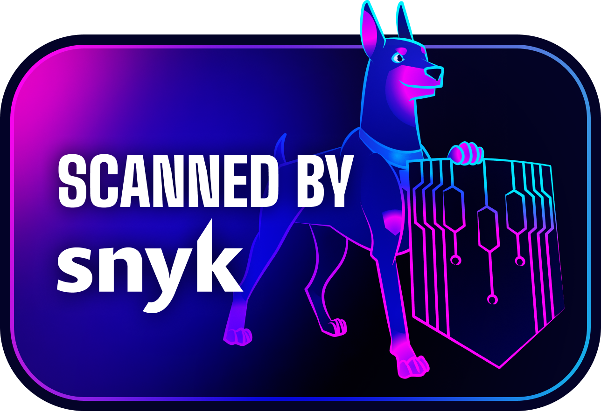

  
  

## Broadsage Containers — Enterprise-Ready Container Platform 🐳

At Broadsage Containers, we deliver **production-ready, security-hardened container images** that bridge the gap between community containers and enterprise requirements. Our platform provides enterprise-grade containerization solutions with zero-compromise security and performance.

*Looking for our main organization? Visit: [**🏢 @broadsage**](https://github.com/broadsage)*

### Container Classification System

Each container image in our platform is categorized with clear labels for easy identification:

| Badge | Description |
|-------|-------------|
|  | Enterprise-ready, production-tested containers with SLA support and guaranteed lifecycle management. |
|  | Community-driven containers welcoming contributions, feedback, and collaborative development. |
|  | Pre-release containers for early adopters and testing in non-production environments. |
|  | Maintained legacy containers for backward compatibility - migration to newer versions recommended. |

### Our Container Solutions 🚀

We specialize in enterprise-grade container images with security best practices and performance optimization:

- 🛡️ **Security-Hardened** — Zero-vulnerability baseline with continuous monitoring and minimal attack surface
- 📦 **Multi-Platform** — Native support for 13+ architectures including AMD64, ARM64, RISC-V, PowerPC, s390x
- ⚡ **Performance-Optimized** — Benchmark-tested for speed, resource efficiency, and cloud-native workloads
- 🔍 **Complete Transparency** — SBOM for every image with open build processes and comprehensive documentation

### Security & Compliance 🔒

We maintain the highest security standards in the container ecosystem:

- ✅ **Daily vulnerability scanning** with Trivy, Snyk, and Grype
- ✅ **Image signing and verification** with Cosign
- ✅ **SBOM generation** for complete supply chain transparency
- ✅ **Non-root runtime** configurations and distroless variants
- ✅ **Compliance-ready** for SOC2, ISO 27001, FIPS standards

### Why Choose Broadsage Containers? 💼

- **Zero-Compromise Security** — Every container maintains continuous security monitoring with zero-vulnerability baseline
- **Enterprise-Grade Quality** — Production-tested with SLA-backed support and predictable lifecycle management
- **Multi-Platform Excellence** — Comprehensive architecture support for any deployment environment
- **Complete Transparency** — Open build processes with full supply chain visibility and documentation

### Getting Started 🚀

Join our container ecosystem — explore production-ready images, deploy with confidence, contribute to security, and scale your applications.

**🐳 Ready to deploy?** Browse our container catalog and find production-ready images for your applications.

**🛡️ Security-focused?** Check out our security documentation and compliance guides for enterprise deployments.

**🤝 Want to contribute?** We welcome contributions from security researchers, container experts, and developers worldwide.

Community Guidelines & Code Of Conduct

 
This code of conduct outlines our expectations for all those who participate in our container platform projects and communities, as well as the consequences for unacceptable behaviour. We invite all those who participate to help us create safe and positive experiences for everyone in the container ecosystem.

#### Expected Community Behavior

The following behaviours are expected and requested of all community members:

* Participate in an authentic and active way. In doing so, you contribute to the health and longevity of our container community.
* Exercise consideration, respect and empathy in your speech and actions. Remember, we have all been through different stages of learning container technologies.
* Refrain from demeaning, discriminatory, or harassing behaviour and speech.
* Focus on constructive discussions about container security, performance, and best practices.
* Disagreements on technical approaches are fine, argumentative behaviour or trolling are not.

#### Unacceptable Community Behavior

* Do not perform threats of violence or use violent language directed against another person.
* Do not make jokes of sexist, racist, homophobic, transphobic, ableist or otherwise discriminatory nature, or use language of this nature.
* Do not post or display sexually explicit or violent material.
* Do not post or threaten to post other people's personally identifying information ("doxing").
* Do not make personal insults, particularly those related to gender, sexual orientation, race, religion, or disability.
* Do not engage in sexual attention. This includes, sexualised comments or jokes and sexual advances.
* Do not advocate for, or encourage, any of the above behaviour.

Please take into account that online communities bring together people from many different cultures and backgrounds. It's important to understand that sometimes the combination of cultural differences and online interaction can lead to misunderstandings. That is why having empathy is very important.

#### Reporting Issues

If someone is acting inappropriately or violating this Code of Conduct in any shape or form, and they are not receptive to your feedback or you prefer not to confront them, please reach out to Broadsage Containers via conduct@broadsage.com

#### Consequences of Unacceptable Behaviour

Unacceptable behaviour from any community member will not be tolerated. Anyone asked to stop unacceptable behaviour is expected to comply immediately. If a community member engages in unacceptable behaviour, Broadsage Containers and/or community organisers may take any action they deem appropriate, up to and including a temporary ban or permanent expulsion from the community without warning.

##### License and attribution

The license is based off of The Citizen Code of Conduct is distributed by Stumptown Syndicate under a Creative Commons Attribution-ShareAlike license.

